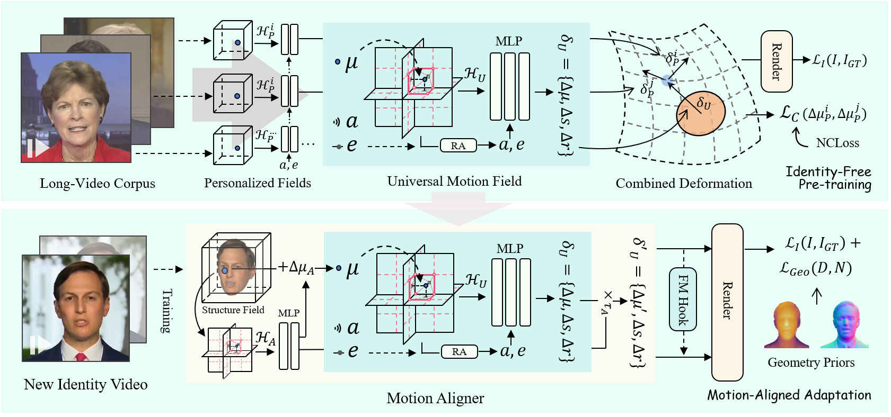

# InsTaG: Learning Personalized 3D Talking Head from Few-Second Video

This is the official repository for our CVPR 2025 paper **InsTaG: Learning Personalized 3D Talking Head from Few-Second Video**.

[Paper]() | [Project](https://fictionarry.github.io/InsTaG/) | [Video]()



🚧 **Code will be released in days. Stay tuned!** 🚧

## Installation

Tested on Ubuntu 18.04, CUDA 11.3, PyTorch 1.12.1

```
conda env create --file environment.yml
conda activate instag
pip install "git+https://github.com/facebookresearch/pytorch3d.git"
pip install tensorflow-gpu==2.8.0
```

If encounter installation problem from the `diff-gaussian-rasterization` or `gridencoder`, please refer to [gaussian-splatting](https://github.com/graphdeco-inria/gaussian-splatting) and [torch-ngp](https://github.com/ashawkey/torch-ngp).

### Preparation

- Prepare face-parsing model and  the 3DMM model for head pose estimation.

  ```bash
  bash scripts/prepare.sh
  ```

- Download 3DMM model from [Basel Face Model 2009](https://faces.dmi.unibas.ch/bfm/main.php?nav=1-1-0&id=details):

  ```bash
  # 1. copy 01_MorphableModel.mat to data_util/face_tracking/3DMM/
  # 2. run following
  cd data_utils/face_tracking
  python convert_BFM.py
  ```

- Prepare the environment for [EasyPortrait](https://github.com/hukenovs/easyportrait):

  ```bash
  # prepare mmcv
  conda activate talking_gaussian
  pip install -U openmim
  mim install mmcv-full==1.7.1
  
  # download model weight
  cd data_utils/easyportrait
  wget "https://n-ws-620xz-pd11.s3pd11.sbercloud.ru/b-ws-620xz-pd11-jux/easyportrait/experiments/models/fpn-fp-512.pth"
  ```

- Prepare the environment for [sapiens](https://github.com/facebookresearch/sapiens/blob/main/lite/README.md):

  ```bash
  conda create -n sapiens_lite python=3.10
  conda activate sapiens_lite
  conda install pytorch torchvision torchaudio pytorch-cuda=12.1 -c pytorch -c nvidia
  pip install opencv-python tqdm json-tricks
  # download the checkpoints of depth and normal from https://github.com/facebookresearch/sapiens/blob/main/lite/README.md
  # and configure the path in ./sapiens/lite/scripts/demo/torchscript/<depth, normal>.sh
  ```

## Usage


### Pre-processing Training Video

* Put training video under `data/<ID>/<ID>.mp4`.

  The video **must be 25FPS, with all frames containing the talking person**. 
  The resolution should be about 512x512, and duration about 1-5 min.

* Run script to process the video.

  ```bash
  python data_utils/process.py data/<ID>/<ID>.mp4
  ```

* Obtain Action Units

  Run `FeatureExtraction` in [OpenFace](https://github.com/TadasBaltrusaitis/OpenFace), rename and move the output CSV file to `data/<ID>/au.csv`.

* Generate tooth masks

  ```bash
  export PYTHONPATH=./data_utils/easyportrait 
  python ./data_utils/easyportrait/create_teeth_mask.py ./data/<ID>
  ```

* Generate sapiens priors

  ```bash
  conda activate sapiens_lite
  cd sapiens/lite
  bash ./run.sh ../../data/<ID>
  ```

### Audio Pre-process

In our paper, we use DeepSpeech features for evaluation. 

* DeepSpeech

  ```bash
  python data_utils/deepspeech_features/extract_ds_features.py --input data/<name>.wav # saved to data/<name>.npy
  ```

### Pre-train

```bash
# We assume all the pre-training video data are in ./data/pretrain. 
# The IDs of used videos can be specified in ./pretrain_face.py and ./pretrain_mouth_con.py
bash scripts/pretrain_con.sh data/pretrain output/<project_name> <GPU_ID>
```

### Adaptation

```bash
# The used pre-training project can be specified in ./train_face_con_few.py and ./train_mouth_con_few.py
bash scripts/train_xx_few_con.sh data/<ID> output/<project_name> <GPU_ID>
```

### Test

```bash
# saved to output/<project_name>/test/ours_None/renders
python synthesize_fuse.py -S data/<ID> -M output/<project_name> --eval  
```

### Inference with Specific Audio

```bash
python synthesize_fuse.py -S data/<ID> -M output/<project_name> --use_train --audio <preprocessed_audio_feature>.npy
```

## Citation

Consider citing as below if you find this repository helpful to your project:

```
@inproceedings{li2025instag,
    title={InsTaG: Learning Personalized 3D Talking Head from Few-Second Video}, 
    author={Li, Jiahe and Zhang, Jiawei and Bai, Xiao and Zheng, Jin and Zhou, Jun and Gu, Lin},
    booktitle={Proceedings of the IEEE/CVF conference on computer vision and pattern recognition},
    year={2025}
}
```


## Acknowledgement

This code is developed on [gaussian-splatting](https://github.com/graphdeco-inria/gaussian-splatting) with [simple-knn](https://gitlab.inria.fr/bkerbl/simple-knn), and a modified [diff-gaussian-rasterization](https://github.com/ashawkey/diff-gaussian-rasterization). Partial codes are from [RAD-NeRF](https://github.com/ashawkey/RAD-NeRF), [DFRF](https://github.com/sstzal/DFRF), [GeneFace](https://github.com/yerfor/GeneFace), and [AD-NeRF](https://github.com/YudongGuo/AD-NeRF). Teeth mask is from [EasyPortrait](https://github.com/hukenovs/easyportrait). Geometry priors are from [sapiens](https://github.com/facebookresearch/sapiens/blob/main/lite/README.md). Thanks for these great projects!
