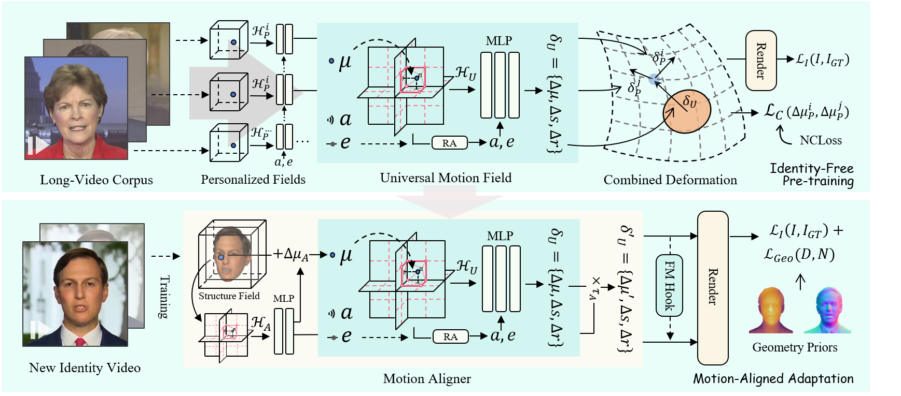

# InsTaG: Learning Personalized 3D Talking Head from Few-Second Video

Official repository for our CVPR 2025 paper **InsTaG: Learning Personalized 3D Talking Head from Few-Second Video**.

[`Paper`](https://openaccess.thecvf.com/content/CVPR2025/papers/Li_InsTaG_Learning_Personalized_3D_Talking_Head_from_Few-Second_Video_CVPR_2025_paper.pdf)  | [`ArXiv`](https://arxiv.org/abs/2502.20387) | [`Project`](https://fictionarry.github.io/InsTaG/) | [`Video`](https://www.youtube.com/watch?v=CJ9aUwPyspg)



## Installation

Tested on Ubuntu 18.04, CUDA 11.3 / 11.7, PyTorch 1.12.1 / 1.13.1

```
git submodule update --init --recursive
conda env create --file environment.yml
conda activate instag
pip install "git+https://github.com/facebookresearch/pytorch3d.git"
pip install tensorflow-gpu==2.10.0
```

If encounter installation problem from the `diff-gaussian-rasterization` or `gridencoder`, please refer to [diff-gaussian-rasterization](https://github.com/slothfulxtx/diff-gaussian-rasterization.git) and [torch-ngp](https://github.com/ashawkey/torch-ngp).

### Preparation

- Prepare pre-trained weights for the tools and the 3DMM model for head pose estimation.

  ```bash
  bash scripts/prepare.sh
  ```

- Download 3DMM model from [Basel Face Model 2009](https://faces.dmi.unibas.ch/bfm/main.php?nav=1-1-0&id=details):

  ```bash
  # 1. copy 01_MorphableModel.mat to data_util/face_tracking/3DMM/
  # 2. run following
  cd data_utils/face_tracking
  python convert_BFM.py
  ```

- Prepare the environment for [EasyPortrait](https://github.com/hukenovs/easyportrait):

  ```bash
  # prepare mmcv
  conda activate instag
  pip install -U openmim
  mim install mmcv-full==1.7.1 prettytable
  
  # download model weight
  wget "https://rndml-team-cv.obs.ru-moscow-1.hc.sbercloud.ru/datasets/easyportrait/experiments/models/fpn-fp-512.pth" -O data_utils/easyportrait/fpn-fp-512.pth
  ```

- Prepare the environment for [sapiens](https://github.com/facebookresearch/sapiens/blob/main/lite/README.md):

  ```bash
  conda create -n sapiens_lite python=3.10
  conda activate sapiens_lite
  conda install pytorch==2.2.1 torchvision==0.17.1 torchaudio==2.2.1 pytorch-cuda=12.1 -c pytorch -c nvidia
  pip install opencv-python tqdm json-tricks
  # Download the sapiens models. Git LFS is required. 
  # We defaultly choose 0.3b models here to save storage and time, while 2b is better.
  # For the Chinese Mainland users, may manually choose the HF mirror in the script for acceleration.
  bash scripts/prepare_sapiens.sh
  ```

## Important Notice
This code is provided for research purposes only. The author makes no warranties, express or implied, as to the accuracy, completeness, or fitness for a particular purpose of the code. Use this code at your own risk.

The author explicitly prohibits the use of this code for any malicious or illegal activities. By using this code, you agree to comply with all applicable laws and regulations, and you agree not to use it to harm others or to perform any actions that would be considered unethical or illegal.

The author will not be responsible for any damages, losses, or issues that arise from the use of this code.

Users are required to use this code responsibly and ethically.

## Data Preparation

### Dataset Organization
The video datas should be seperated as two parts. In our paper, we take 5 long videos to compose the pre-training set stored in `./data/pretrain`, and use the others for test. 
Our recommend structure is as follow:

```
./data/
├──pretrain # pre-training set
│  ├──<ID 1>
│  │  └──<ID 1>.mp4 # original video
│  ├──<ID 2>
│  │  └──<ID 2>.mp4 # original video
│  .. ..
├──<ID 3> # other data for test 
│  └─<ID 3>.mp4 # original video
.. ..
```

### Pre-processing Training Video

- Put training video under `data/<ID>/<ID>.mp4`.

  The video **must be 25FPS, with all frames containing the talking person**. 

  The resolution should be about 512x512.

- Run script to process the video.

  ```bash
  # Required.
  python data_utils/process.py data/<ID>/<ID>.mp4
  # Optional. To retain at least 12s data for evaluation.
  python data_utils/split.py data/<ID>/<ID>.mp4    
  ```

- Obtain Action Units

  Run `FeatureExtraction` in [OpenFace](https://github.com/TadasBaltrusaitis/OpenFace), rename and move the output CSV file to `data/<ID>/au.csv`.

- Generate tooth masks

  ```bash
  export PYTHONPATH=./data_utils/easyportrait 
  python ./data_utils/easyportrait/create_teeth_mask.py ./data/<ID>
  ```

- Generate geometry priors.
  
  Only for adaptation. Not required for pre-training data.

  ```bash
  conda activate sapiens_lite
  # Generate geometry priors for the first 500 images in default using 4 GPUs.
  # You can configure them at ./data_utils/sapiens/lite/scripts .
  bash ./data_utils/sapiens/run.sh ./data/<ID>
  ```

### Audio Pre-process

In our paper, we use DeepSpeech features for evaluation. Additionally, we find AVE from [SyncTalk](https://github.com/ZiqiaoPeng/SyncTalk) performs remarkably, despite a bit of instability.

- DeepSpeech

  The extractor we used in experiments for evaluations.

  ```bash
  # saved to data/<name>.npy
  python data_utils/deepspeech_features/extract_ds_features.py --input data/<name>.wav 
  ```

- Wav2Vec
  
  Performs better than DeepSpeech for most cases.

  ```bash
  # save to data/<name>_eo.npy
  python data_utils/wav2vec.py --wav data/<name>.wav --save_feats 
  ```

- AVE

  With the best lip-synchronization in most few-shot cases, especially for English, but may cause jitter and crash.

  ```bash
  # No operation needed in this step. 
  ```

- HuBERT
  
  Good generalizability for non-English languages like Chinese and other OOD situations. Work better with a longer training video.

  Notably, in our test, HuBERT does not perform very ideally for extreme few-shot scenarios, maybe due to its high dimension. Recommend using at least 10s data for training.

  ```bash
  # Borrowed from GeneFace. English pre-trained.
  python data_utils/hubert.py --wav data/<name>.wav # save to data/<name>_hu.npy
  ```

### Pre-training

We assume all the pre-training video data are in `./data/pretrain`. The IDs of used videos can be specified in `./pretrain_face.py` and `./pretrain_mouth.py`. 

In our paper, we use five videos for pre-training, including three videos "Obama1", "Jae-in", "Shaheen" from [GeneFace](https://drive.google.com/drive/folders/1vimGVNvP6d6nmmc8yAxtWuooxhJbkl68), and "may", "macron" from [TalkingGaussian](https://drive.google.com/drive/u/1/folders/1E_8W805lioIznqbkvTQHWWi5IFXUG7Er).


After organizing and pre-processing the videos, run the script to start pre-training.

```bash
# Several scripts are available in ./scripts for different audio extractors.
bash scripts/pretrain_con.sh data/pretrain output/<project_name> <GPU_ID>
```

**Memory Hints**: Please be cautious about the consumption of computer memory. Each 5-minute training data requires about 12GB RAM for the preloading. You may implement on-the-fly loading by yourself to reduce the consumption.

**Checkpoints**: Here we provide four pre-training weights: [Google Drive](https://drive.google.com/drive/folders/1R77F6YN1QUldjqAi3fsXs2N8rrsRYMPP?usp=sharing). You may unzip and put them in `./output` for testing. Note that these pre-training weights are for research purposes, corresponding to our paper. You may need to retrain the model with customized data, language, and configuration to get personally required performance.

Additionally, a trial weight pre-trained with data including Chinese videos is provided [here](https://drive.google.com/file/d/1EyG1T07AZKO0_U6IfezB0GY_c9LvpClh/view?usp=drive_link). 


### Adaptation

Given a new identity, run the script to train a new person-specific model based on the pre-training.

```bash
# Audio encoder and pre-training checkpoint can be configured in the script.
# By default, 10s data is used.
bash scripts/train_xx_few.sh data/<ID> output/<project_name> <GPU_ID>
```

The video of the new identity will be separated into a training clip, and a test clip with at least 12s length. Evaluation metrics will be calculated and reported on the test set.

The videos used for test in our paper is fetched from [DFRF](https://github.com/sstzal/DFRF/tree/main/dataset/vids) ("cnn", "cnn2", "english_w") and [GeneFace](https://drive.google.com/drive/folders/1vimGVNvP6d6nmmc8yAxtWuooxhJbkl68) ("Lieu"). You can first start with these videos to check the correctness of the environment installation.

<!-- For research purposes, it is notable that there should not be character overlap between the pre-training set and test set for fairness, e.g., since we have used one Obama video in pre-training, it's not expected to use another video with Obama to evaluate the adaptation, even if they are captured at different times.  -->

#### Options

Here are some options that may help customization. Some defaults are set in the scripts.

- `--audio_extractor`: Specify the type of used audio extractor. Options: `deepspeech` (default), `ave`, `esperanto` `hubert`.
  
- `--N_views`: For training only. The number of frames used in training, 25 frames per second. `-1` denotes using all the training clip.

- `--long`: For training only. Specify it if data is sufficient, i.e., using minutes or longer video for training. Geometry regularization is forbidden under such mode with `--N_views -1`, so you can skip the generating of geometry priors. 

- `--all_for_train`: For training only. Merge training and test clip together to train the model. Note that after specifying this, the reported metrics will become invalid.

- `--use_train`: For Inference only. Use the pose sequence of the training set to drive the rendering.


#### Test

Run the script to render the test clip.

```bash
# Saved to output/<project_name>/test/ours_None/renders
# Specify `--audio_extractor` if not using DeepSpeech
python synthesize_fuse.py -S data/<ID> -M output/<project_name> --eval  
```

#### Inference with Specified Audio

You can also specify an audio to drive the talking head.

```bash
# Specify `--audio_extractor` if not using DeepSpeech
# If AVE is used, please set the path of a .wav file for `--audio`.
python synthesize_fuse.py -S data/<ID> -M output/<project_name> --dilate --use_train --audio <preprocessed_audio_feature>.npy --audio_extractor ave
```

## Citation

Consider citing as below if you find this repository helpful to your project:

```
@inproceedings{li2025instag,
    title={InsTaG: Learning Personalized 3D Talking Head from Few-Second Video}, 
    author={Li, Jiahe and Zhang, Jiawei and Bai, Xiao and Zheng, Jin and Zhou, Jun and Gu, Lin},
    booktitle={Proceedings of the IEEE/CVF conference on computer vision and pattern recognition},
    year={2025}
}
```


## Acknowledgement

This code is developed on [gaussian-splatting](https://github.com/graphdeco-inria/gaussian-splatting) with [simple-knn](https://gitlab.inria.fr/bkerbl/simple-knn), and a modified [diff-gaussian-rasterization](https://github.com/slothfulxtx/diff-gaussian-rasterization.git). Partial codes are from [RAD-NeRF](https://github.com/ashawkey/RAD-NeRF), [DFRF](https://github.com/sstzal/DFRF), [GeneFace](https://github.com/yerfor/GeneFace), and [AD-NeRF](https://github.com/YudongGuo/AD-NeRF). Teeth mask is from [EasyPortrait](https://github.com/hukenovs/easyportrait). Geometry priors are from [sapiens](https://github.com/facebookresearch/sapiens/blob/main/lite/README.md). Thanks for these great projects!
